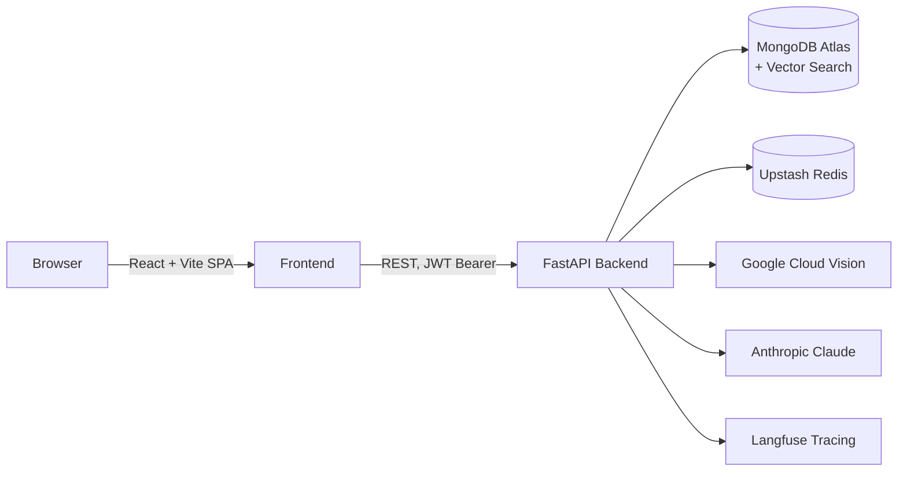

# DocFalcon

AI-powered HR document intelligence platform. DocFalcon ingests identity and employment documents (Iqama, passport, visa, contracts), extracts structured data with OCR and an LLM, and exposes the results through a RAG-based chat assistant, a compliance agent, and an employee records system.

[](LICENSE)
[](backend/requirements.txt)
[](backend/main.py)
[](frontend/package.json)
[](backend/services/vector_store.py)
[](docker-compose.yml)
[](backend/services/llm_client.py)

## Table of Contents

- [Overview](#overview)
- [Key Features](#key-features)
- [Architecture](#architecture)
- [Tech Stack](#tech-stack)
- [Project Structure](#project-structure)
- [Getting Started](#getting-started)
  - [Prerequisites](#prerequisites)
  - [Run with Docker Compose](#run-with-docker-compose)
  - [Run Locally](#run-locally)
- [Environment Variables](#environment-variables)
- [API Reference](#api-reference)
- [Testing](#testing)
- [Security](#security)
- [License](#license)

## Overview

DocFalcon automates the manual work of HR document processing. A user uploads one or more documents for an employee; the backend runs OCR, classifies the document type, extracts structured fields with an LLM, and writes the result to MongoDB. Once indexed, documents become searchable through a retrieval-augmented chat interface, and a separate compliance agent can be asked about expiring documents or mismatched names across an employee's file.

## Key Features

- **OCR + LLM Extraction** — Google Cloud Vision OCR (with Arabic digit normalization) feeds structured field extraction for Iqama, passport, visa, and contract documents.
- **Multi-Document Onboarding Agent** — A Claude tool-use agent classifies, extracts, cross-checks names, and creates or updates employee records from a batch of uploaded files in a single pass.
- **Company-Wide RAG Chat** — Ask natural-language questions across all indexed documents, with MongoDB Atlas vector search retrieval, citation metadata, and multi-turn conversation history.
- **Compliance Agent** — A dedicated tool-use agent surfaces documents expiring within N days, summarizes an employee's document status, and flags name mismatches across an employee's files.
- **Employee Records API** — Full CRUD for employee profiles and their linked documents.
- **Dashboard** — Aggregate stats across employees and documents.
- **Authentication** — JWT access/refresh tokens with rotation, Google OAuth login, and protected frontend routes.
- **Security Hardening** — Per-route rate limiting, strict security headers (CSP, X-Frame-Options, HSTS in production), and a config validator that refuses to boot with insecure production settings.
- **Caching** — Upstash Redis caching layer for expensive reads.
- **Observability** — Langfuse tracing on every LLM call for latency and cost tracking, plus an evaluation harness for the RAG pipeline and agents.

## Architecture



See [docs/architecture.md](docs/architecture.md) for further notes.

## Tech Stack

| Layer        | Technologies |
|--------------|--------------|
| **Backend**  | Python 3.11, FastAPI, Uvicorn, Pydantic v2, Motor / PyMongo, slowapi (rate limiting) |
| **AI / ML**  | Anthropic Claude (extraction, onboarding agent, compliance agent), Google Cloud Vision (OCR), sentence-transformers (multilingual embeddings), Langfuse (tracing) |
| **Frontend** | React 19, Vite, React Router 7, Tailwind CSS 4, shadcn/ui, Base UI, Axios |
| **Data**     | MongoDB Atlas (documents + vector search), Upstash Redis (cache) |
| **Infra**    | Docker, Docker Compose, Nginx (frontend serving) |
| **Testing**  | pytest, pytest-asyncio |

## Project Structure

```
docfalcon/
├── backend/
│   ├── core/            # config, database, security, middleware, tracing
│   ├── models/           # Pydantic data models
│   ├── routers/          # auth, extract, employees, dashboard, chat, onboard, compliance
│   ├── services/          # ocr, agent, chat, rag, embeddings, vector_store, cache, llm_client
│   ├── tools/             # LLM tool-call implementations used by the agents
│   ├── tests/             # unit tests + RAG/agent evaluation harness
│   └── main.py            # FastAPI app entrypoint
├── frontend/
│   └── src/
│       ├── components/     # shared UI + shadcn primitives
│       ├── context/        # auth context
│       ├── lib/            # API client, utilities
│       └── pages/          # Login, Dashboard, Employees, Upload, Onboard, Chat, Compliance
├── docs/                  # architecture notes, sample data
├── docker-compose.yml
└── Dockerfile
```

## Getting Started

### Prerequisites

- Python 3.11+
- Node.js 18+
- A MongoDB Atlas cluster with a vector search index
- An Anthropic API key (and/or Groq API key)
- A Google Cloud Vision service account key (for OCR)
- Docker and Docker Compose (for the containerized setup)

### Run with Docker Compose

```bash
git clone https://github.com/Zahoor-ishfaq/docfalcon.git
cd docfalcon

# configure environment
cp backend/.env.example backend/.env
cp frontend/.env.example frontend/.env.local
# fill in the required values in both files, and place your
# Google Cloud Vision service account key at backend/google-vision-key.json

docker compose up --build
```

- Backend: [http://localhost:8000](http://localhost:8000)
- Frontend: [http://localhost:5173](http://localhost:5173)

### Run Locally

**Backend**

```bash
cd backend
python -m venv venv
venv\Scripts\activate        # Windows
# source venv/bin/activate   # macOS / Linux

pip install -r requirements.txt
cp .env.example .env         # fill in the required values

uvicorn main:app --reload --port 8000
```

**Frontend**

```bash
cd frontend
npm install
cp .env.example .env.local   # fill in the required values

npm run dev
```

## Environment Variables

Configured via `backend/.env` (see [backend/.env.example](backend/.env.example)):

| Variable | Description |
|----------|--------------|
| `LLM_PROVIDER` | `claude` or `groq` |
| `ANTHROPIC_API_KEY` / `GROQ_API_KEY` | LLM provider credentials |
| `MONGODB_URL` | MongoDB Atlas connection string |
| `REDIS_URL` / `REDIS_TOKEN` | Upstash Redis credentials |
| `JWT_SECRET` | Signing secret for access/refresh tokens (32+ chars in production) |
| `JWT_EXPIRE_MINUTES` / `REFRESH_TOKEN_EXPIRE_DAYS` | Token lifetimes |
| `GOOGLE_CLIENT_ID` / `GOOGLE_CLIENT_SECRET` | Google OAuth login |
| `GOOGLE_APPLICATION_CREDENTIALS` | Path to the Vision API service account key |
| `POPPLER_PATH` | Poppler binary path (Windows only, for PDF-to-image conversion) |
| `EMBEDDING_MODEL` | sentence-transformers model name |
| `VECTOR_INDEX_NAME` | MongoDB Atlas vector search index name |
| `LANGFUSE_PUBLIC_KEY` / `LANGFUSE_SECRET_KEY` / `LANGFUSE_HOST` | LLM tracing and cost tracking |
| `ENVIRONMENT` | `development` or `production` |
| `ALLOWED_ORIGINS` | Comma-separated CORS origins |

Configured via `frontend/.env.local` (see [frontend/.env.example](frontend/.env.example)):

| Variable | Description |
|----------|--------------|
| `VITE_API_URL` | Backend base URL |
| `VITE_GOOGLE_CLIENT_ID` | Google OAuth client ID |

## API Reference

All routes except `/health`, `/auth/register`, `/auth/login`, `/auth/refresh`, and `/auth/google` require a JWT bearer token.

| Method | Endpoint | Description |
|--------|----------|--------------|
| `GET`  | `/health` | Service and database health check |
| `POST` | `/auth/register` | Create a new user account |
| `POST` | `/auth/login` | Authenticate and receive access/refresh tokens |
| `POST` | `/auth/refresh` | Exchange a refresh token for a new access token |
| `POST` | `/auth/logout` | Revoke the current refresh token |
| `POST` | `/auth/google` | Authenticate via Google OAuth |
| `POST` | `/extract` | Run OCR + LLM extraction on an uploaded document |
| `POST` | `/onboard` | Run the multi-document onboarding agent on a batch of files |
| `GET`  | `/employees` | List employees |
| `POST` | `/employees` | Create an employee |
| `GET`  | `/employees/{id}` | Get an employee by ID |
| `PUT`  | `/employees/{id}` | Update an employee |
| `DELETE` | `/employees/{id}` | Delete an employee |
| `GET`  | `/dashboard/stats` | Aggregate dashboard statistics |
| `POST` | `/chat` | Ask a RAG-backed question across company documents |
| `POST` | `/compliance/ask` | Ask the compliance agent about expirations, summaries, or name mismatches |

Interactive Swagger docs are available at `/docs` when `ENVIRONMENT=development`.

## Testing

```bash
cd backend
pytest
```

The test suite covers authentication, employee records, caching, OCR, and security headers/rate limiting (`backend/tests/`). A separate evaluation harness (`backend/tests/eval/`) scores RAG retrieval quality and agent tool-use against a labeled dataset, with results tracked in Langfuse.

## Security

- JWT access tokens with rotating, single-use refresh tokens (TTL-indexed in MongoDB)
- Per-route rate limiting via slowapi
- Strict security headers on every response (CSP, X-Frame-Options, Referrer-Policy, Permissions-Policy, HSTS in production)
- Production boot-time validation: refuses to start with a wildcard/localhost CORS origin or a short `JWT_SECRET`
- Non-root Docker runtime user
- No secrets committed to the repository — see [backend/.gitignore](backend/.gitignore)

If you discover a security issue, please open a private report rather than a public issue.

## License

Distributed under the MIT License. See [LICENSE](LICENSE) for details.

---

Built by [Zahoor Ishfaq](https://github.com/Zahoor-ishfaq).
